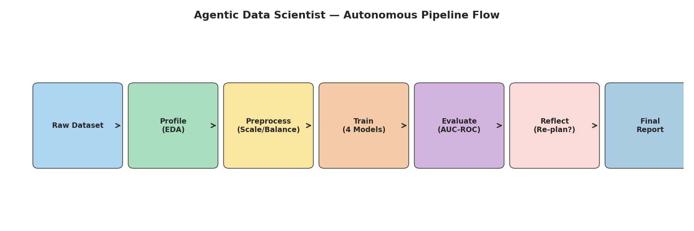
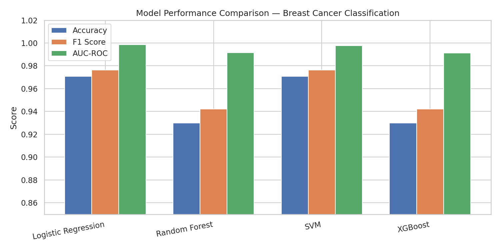
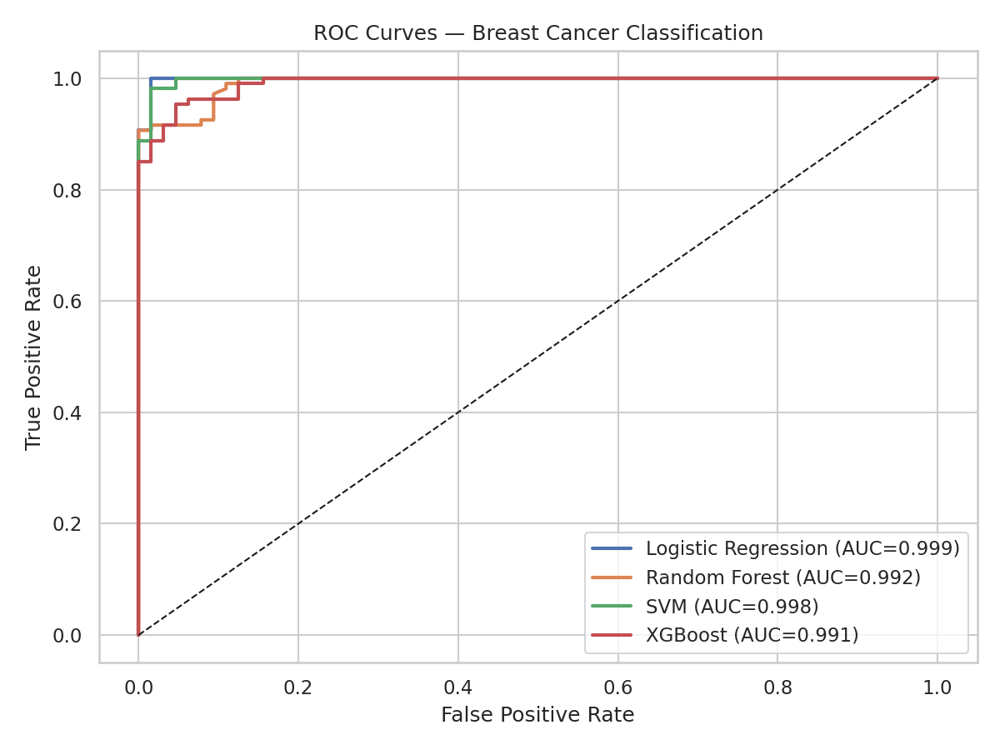
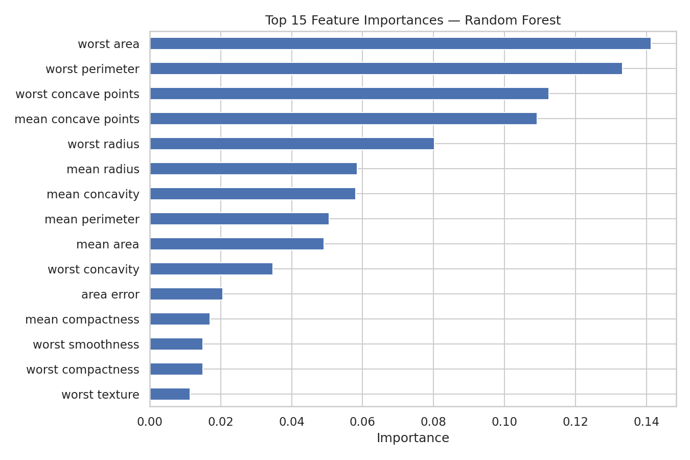

# Agentic Data Scientist

[](https://python.org)
[](https://scikit-learn.org)
[](https://xgboost.readthedocs.io)
[](https://langchain.com)

An **autonomous AI agent** with planner, tools, memory, and reflection components that profiles CSV datasets, selects preprocessing and modelling strategies, evaluates results, and re-plans when performance falls below a target threshold. Designed to run fully offline using local LLM inference (LLaVA / Ollama).

---

## Architecture



The agent implements a closed-loop control flow:

| Component | Role |
|-----------|------|
| **Profiler** | Extracts metadata — shape, dtypes, missing values, class balance |
| **Planner** | Selects the next model strategy from a priority queue |
| **Executor** | Runs preprocessing (70/30 split, balanced training) and model training |
| **Evaluator** | Computes Accuracy, F1, and AUC-ROC on the held-out test set |
| **Reflector** | Compares AUC-ROC against a threshold and triggers re-planning if needed |
| **Memory** | Persists all experiment records to a structured JSONL log |

---

## Results — Breast Cancer Wisconsin Dataset



| Model | Accuracy | F1 Score | AUC-ROC |
|-------|----------|----------|---------|
| Logistic Regression | 0.9708 | 0.9763 | **0.9985** |
| SVM | 0.9708 | 0.9763 | 0.9977 |
| Random Forest | 0.9298 | 0.9423 | 0.9916 |
| XGBoost | 0.9298 | 0.9423 | 0.9912 |





---

## Repository Structure

```
Agentic-Data-Scientist/
├── agent.py                        # Main autonomous agent
├── tools/
│   ├── eda_tools.py                # Dataset profiling and EDA utilities
│   └── model_tools.py              # Preprocessing, training, and evaluation
├── data/
│   └── breast_cancer.csv           # Breast Cancer Wisconsin dataset
├── notebooks/
│   └── 01_agent_demo.ipynb         # Full walkthrough notebook
├── results/
│   ├── agent_flow.png              # Agent architecture diagram
│   ├── model_comparison.png        # Performance bar chart
│   ├── roc_curves.png              # ROC curves for all models
│   ├── confusion_matrix.png        # Confusion matrix (best model)
│   ├── feature_importance.png      # Top-15 feature importances
│   └── experiment_log.jsonl        # Structured experiment log
└── requirements.txt
```

---

## Setup and Usage

```bash
# Clone the repository
git clone https://github.com/MoustafaAboElkheir/Agentic-Data-Scientist.git
cd Agentic-Data-Scientist

# Install dependencies
pip install -r requirements.txt

# Run the agent on the sample dataset
python agent.py --dataset data/breast_cancer.csv --target target

# Or explore the full notebook
jupyter notebook notebooks/01_agent_demo.ipynb
```

---

## Methodology

The train/test split follows a **70% training / 30% testing** methodology. The training set is balanced to a 50-50 class ratio using random undersampling to ensure equal class representation during training. The test set is left as-is (out-of-sample) to provide an unbiased performance estimate.

---

*Created by Moustafa AbouElkheir | MSc Artificial Intelligence, University of Essex*
